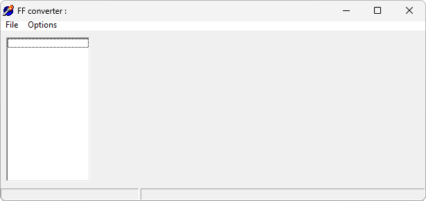

{/* Generated by tools/generateSoftware.ts. Do not edit manually. */}

# FF Converter

FF Converter открывает дампы прошивки Siemens в форматах BIN и FLS, определяет
тип flash-памяти и сохраняет данные как FullFlash в формате BIN.

## Версии

- **1.0** — [ff-converter-1.0.zip](https://git.siepatch.dev/siepatch/soft/media/branch/main/catalog/utilities/ff-converter/files/ff-converter-1.0.zip) Windows 32-bit · 199 КиБ
