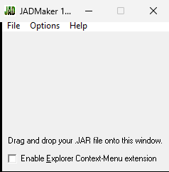

# JADMaker

**Автор:** Goh Mingkun

JADMaker создаёт файл описания JAD по манифесту готового JAR. Поддерживаются обработка нескольких файлов, перетаскивание JAR в окно программы и команда `Make JAD` в контекстном меню Проводника.

## Версии

- **1.15** — [jadmaker-1.15.zip](https://git.siepatch.dev/siepatch/soft/media/branch/main/catalog/utilities/jadmaker/files/jadmaker-1.15.zip) (2005-01-13) Windows 32-bit · 67.7 КиБ
