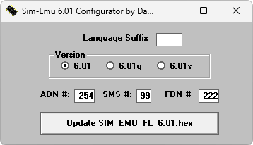

# SIM-EMU

SIM-EMU эмулирует SIM-карту на программируемых GreenCard 2, GreenCard и SilverCard с контроллерами PIC16F876/7 и памятью
24C256/128/64. В комплект входят конфигуратор, прошивки на нескольких языках и скрипты для чтения и записи телефонной книги и SMS.

## Версии

- **6.01** — [sim-emu-6.01.zip](https://git.siepatch.dev/siepatch/soft/media/branch/main/catalog/utilities/sim/sim-emu/files/sim-emu-6.01.zip) (2003-07-02) Windows 32-bit · 568 КиБ
