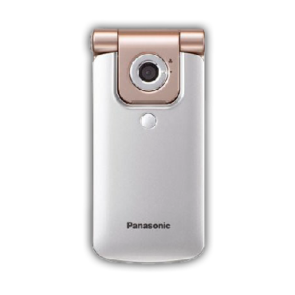
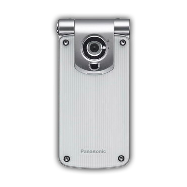
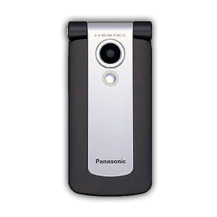
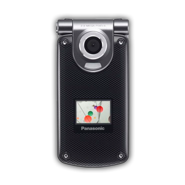
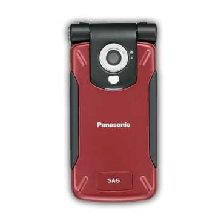
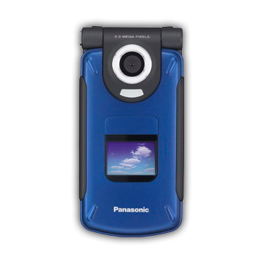
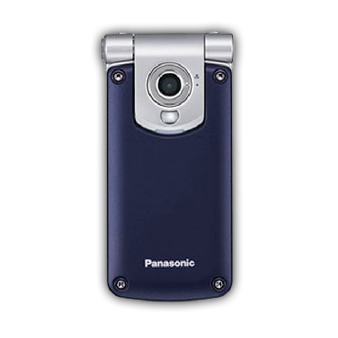
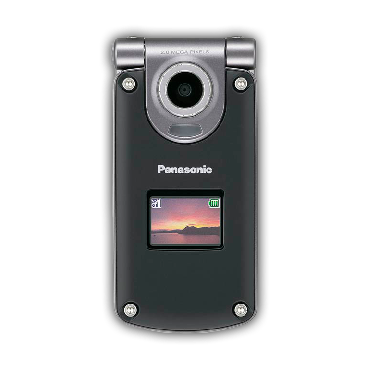
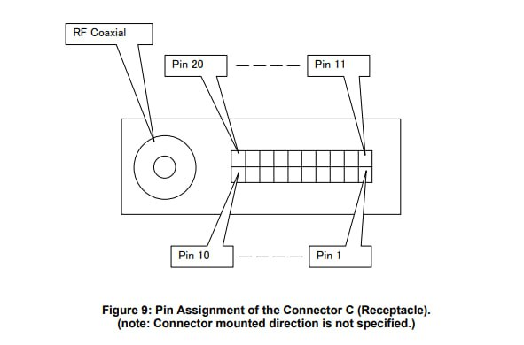
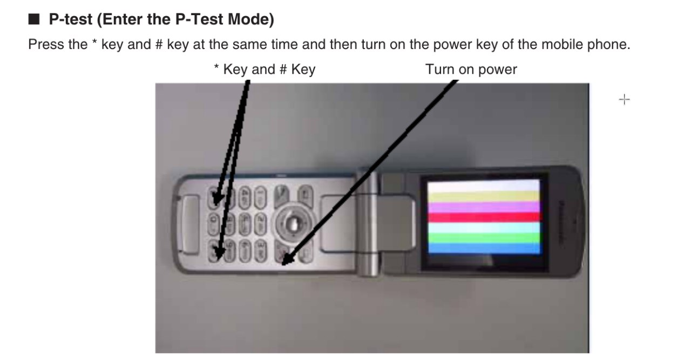

# Panasonic SGOLD

Some Panasonic phones are equipped with hardware from Infineon. Models with a checkmark have internal photos available. The rest are filled in either by FCCID or intuition.

| Model               | VS2                    | VS3                    | VS6                    | VS7 ☑                       | SA6                    | SA7 ☑                       | MX6                    | MX7                         |
|:--------------------|:-----------------------|:-----------------------|:-----------------------|:----------------------------|:-----------------------|:----------------------------|:-----------------------|:----------------------------|
| Photo               |     |     |     |          |     |          |     |          |
| FCCID               |                        | NWJ23C002A             |                        | NWJ26C001A                  |                        |                             |                        |                             |
| OS                  | APOXI                  | APOXI                  | APOXI                  | APOXI                       | APOXI                  | APOXI                       | APOXI                  | APOXI                       |
| CPU                 | PMB8875                | PMB8875                | PMB8875                | PMB8875                     | PMB8875                | PMB8875                     | PMB8875                | PMB8875                     |
| POWER               | ?                      | PMB6812                | ?                      | PMB6811                     | ?                      | PMB6811                     | ?                      | PMB6811                     |
| RF                  | PMB6270                | PMB6270                | PMB6270                | PMB6270                     | PMB6270                | PMB6270                     | PMB6270                | PMB6270                     |
| PAM                 | SKY77328               | SKY77328               | SKY77328               | SKY77328                    | SKY77328               | SKY77328                    | SKY77328               | SKY77328                    |
| FLASH+RAM           | 64/16: PF38F4460LVYTB0 | 64/16: PF38F4460LVYTB0 | 64/16: PF38F4460LVYTB0 | 64/16: PF38F4460LVYTB0      | 64/16: PF38F4460LVYTB0 | 64/16: PF38F4460LVYTB0      | 64/16: PF38F4460LVYTB0 | 64/16: PF38F4460LVYTB0      |
| Resolution&bit&size | 240x320x24, 2.2"       | 240x320x24, 2.2"       | 240x320x24, 2.2"       | 240x320x24, 2.5" & 96x64x12 | 240x320x24, 2.2"       | 240x320x24, 2.5" & 96x64x12 | 240x320x24, 2.2"       | 240x320x24, 2.5" & 96x64x12 |
| LCD                 | ?                      | ?                      | ?                      | ?                           | ?                      | ?                           | ?                      | ?                           |
| GPU                 | S1D13756               | S1D13756               | S1D13756               | S1D13756                    | S1D13756               | S1D13756                    | S1D13756               | S1D13756                    |
| BT                  | no                     | no                     | PMB8761                | PMB8761                     | no                     | PMB8761                     | no                     | PMB8761                     |
| IrDA                | yes                    | yes                    | yes                    | yes                         | yes                    | yes                         | yes                    | yes                         |
| Camera              | 1.3 MP                 | 1.3 MP                 | 2.0 MP                 | 2.0 MP                      | 1.3 MP                 | 2.0 MP                      | 1.3 MP                 | 2.0 MP                      |
| Macro switch        | Outer                  | Outer                  | Inner                  | Inner                       | Outer                  | Inner                       | Outer                  | Inner                       |
| Bat.cap.            | 830 mAh                | 830 mAh                | 830 mAh                | 830 mAh                     | 1660 mAh               | 1660 mAh                    | 1660 mAh               | 1660 mAh                    |
| Covers              | Static                 | Changeable             | Static                 | Changeable                  | Static                 | Static                      | Changeable             | Changeable                  |
| Dimensions          | 96x46x18.2mm, 98g      | 96x46x17.6mm, 102g     | 96x46x21mm, 101g       | 102x51x18.8mm, 113g         | 96x47x25mm, 127g       | 102x53x26mm, 140g           | 96x46x26mm, 130g       | 102x51x26mm, 144g           |

# Software Version Check
1. Turn on the phone without a SIM card.
2. Quickly enter `*#9999#`.
3. If nothing happens, the input was not fast enough.

# PC Connection
Possible by two methods:
1. USB cable. Allows file transfer, using PTEST mode, and dumping flash memory or RAM contents. And even a bit of patching.
2. UART cable. Used for working with Chaos boot from V_Klay and x65flasher.
3. Theoretically Bluetooth (if available) and IrDA, but this has not been tested by us.

## Phone Connector
The connector on these phones is [ARIB C](https://www.arib.or.jp/english/html/overview/doc/STD-T63V13_30/3_T12/ARIB-TR-T12/R99/27/A27A01-330.pdf).



## UART Pinout
| Gnd | Rx | Tx |
|-----|----|----|
| 1   | 7  | 9  |

## USB Pinout
| Gnd | D+ (USB_DP) | D- (USB_DN) | +5V (usb_vbus+ext_per) |
|-----|-------------|-------------|------------------------|
| 1   | 2           | 3           | 4+5                    |

## Driver Installation
Drivers are suitable from the manufacturer's disk. Download here - [VS7SA7_Handset_Manager_USB.zip](https://fw.fasoley.net/?file=panasonic/VS7SA7_Handset_Manager_USB.zip) Tested on Windows XP and Windows 8.1 x86.

# Entering PTEST
PTEST - production test - is the phone's test mode. Preferred for working with the phone in a state not intended by the manufacturer. Press * and # simultaneously, and while they are pressed, turn on the phone with the red button.



# Service Software
Applicable from Infineon itself under the name PhoneTool. Versions 50 and 60 complement each other: in 60, the Audio tab and RAM read/write work, in 50 everything else.

## Download
- [PhoneTool x50](https://fw.fasoley.net/?file=panasonic/phonetool/PhoneTool%2050_setup.exe) + [patched dwdio.dll](https://fw.fasoley.net/?file=panasonic/phonetool/dwdio.dll)
- [PhoneTool x60]

## Installation
- x50: install, replace `dwdio.dll` in the installation location with the patched one, use.
- x60: unpack, import `x60factory-registri.zip\m\m\x60.reg` into the registry, use.

## Usage
After starting, specify the required COM port in Settings. Connect using the `Update info` button, if it doesn't work the first time - press the `V24 AT# on/off` buttons.

# Flash Memory Dump
Can be done from both Linux and Windows with any cable (USB or UART). First, you need to enter the phone into PTEST.

## Arch Linux
```bash
yay -S pnpm
git clone https://github.com/siemens-mobile-hacks/node-sie-serial
cd node-sie-serial/
pnpm i
npx tsx examples/dwd-apoxi-memory-dump.js \
  --addr 0xA0000000 \     # Memory address where the device's flash memory starts
  --size 0x4000000 \      # Read length, 64 megabytes
  --out ./sa7-vq24.bin \  # File name where the content will be saved
  --port /dev/ttyACM0     # Device path
```

## Windows
1. https://scoop.sh/
2. https://git-scm.com/downloads/win
3. `scoop bucket add main`
4. `scoop install main/nodejs`
5. `corepack enable`
6. `git clone https://github.com/siemens-mobile-hacks/node-sie-serial`
7. `cd node-sie-serial`
8. `pnpm i`
9. `npx tsx examples/dwd-apoxi-memory-dump.js --addr 0xA0000000 --size 0x4000000 --out .\sa7-vq24.bin --port COM7`

# Bootloader Unlocking
Similarly possible on both Linux and Windows with any cable (USB or UART). Performed from PTEST. Required for the ability to write flash memory to the phone using V_Klay or x65flasher.

## Linux
1. `cd node-sie-serial`
2. `npx tsx examples/dwd-apoxi-unlock-boot.ts --port /dev/ttyACM0`

## Windows
1. `cd node-sie-serial`
2. `npx tsx examples\dwd-apoxi-unlock-boot.ts --port COM7`

# Flash Memory Writing
Possible only via UART. Briefly: install [V_Klay](https://fw.fasoley.net/?file=panasonic/v_klay_setup.zip), place [pmb8875_test_point.vkd](https://fw.fasoley.net/?file=panasonic/pmb8875_test_point.vkd) in the `Program Files\Vi-Soft\V_Klay\loaders\` folder, and then, after selecting this loader, connect to the phone at a speed of 115200 for writing or 921600 for reading. With [x65flasher](https://fw.fasoley.net/?file=panasonic/x65Flasher-2103.rar) it's somewhat simpler: select the loader "Phone with entered SKEY", work at the same speeds.

# Firmware Update
Possible only via UART. First, you need to back up your EEPROM as it contains radio path and battery calibrations. This can be done with PhoneTool x50, specifying the EEPROM configuration file (for VS7/SA7/MX7 this is [leopard_eep150.cfg](https://fw.fasoley.net/?file=panasonic/eeprom/leopard_eep150.cfg)). After saving the EEPROM backup, download the desired version dump, write it to the phone using x65flasher or V_Klay. Then reconnect the phone to PhoneTool x50 and import the previously saved EEPROM dump.