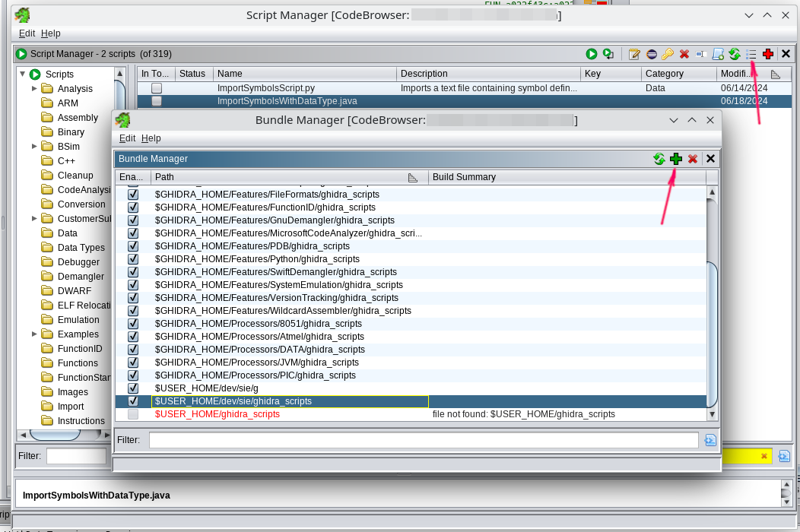
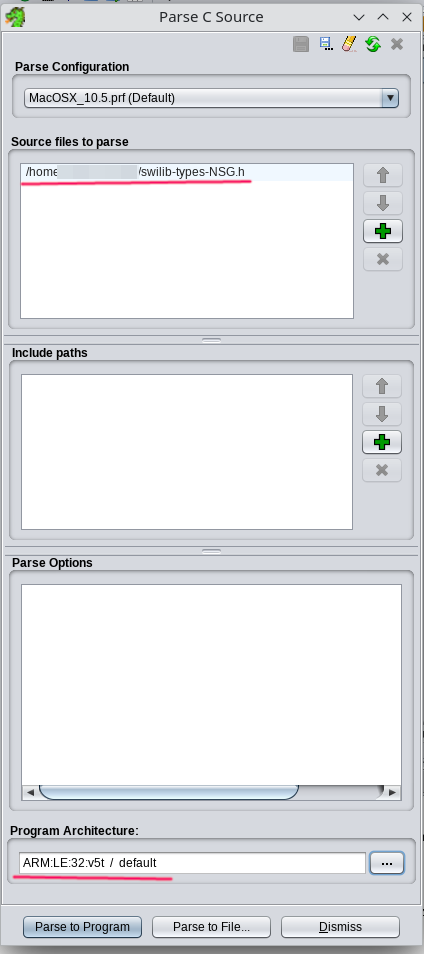
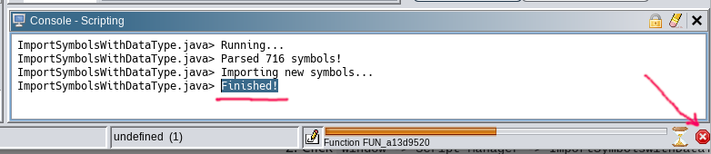

[← Back to the index](./index.md)

# How to reverse engineering Siemens in 2k24?
Prerequisites:
1. Install **Ghidra SRE v11.1.1** and fix `ARMTHUMBinstructions.sinc`.

   Since about 2019 there has been a bug in Ghidra SRE where `FF FF` is treated as an `BL 0xFFE` instruction in v5t architecture. This causes an infinity loop in auto-analysis.

   You **should** apply [patch ARMTHUMBinstructions.sinc](./fixing-ARMTHUMBinstructions.sinc.md) if you want to work with Siemens firmwares.

3. Obtain fullflash from your phone and remove FFS & EEPROM from it.

   This is important for auto-analysis, beacause FFS and EEPROM contain ambiguous data which can be treated as instructions.

   You can download a collection of the fullflashes with already removed FFS and EEPROM: [fullflashes.zip](https://github.com/siemens-mobile-hacks/elfloader3/releases/download/v0/fullflashes.zip).
    
4. [Obtain RAM & SRAM memory dumps from your phone.](./memory-dump.md)

### Step 1: Open fullflash in the Ghidra
1. Run the disassembler and click: `File -> Import File`
2. Select your fullflash.bin
3. Choose the appropriate disassembler settings:
    - Format: `Raw Binary`
    - Language: `ARM v5t 32 little`
    - Options -> Block Name: `FULLFLASH`
    - Options -> Base Address: `A0000000`
   <details>
        <summary>Sreenshot</summary>
        
        
    </details>

5. Then click on `fullflash.bin` in the project files.
6. Reject automatic analysis (press **No**).
    <details>
        <summary>Screenshot</summary>
        
    </details>

### Step 2. Fix attributes for FULLFLASH memory region
Click `Window -> Memory Map` and select attributes for "FULLFLASH":

   ```
    R   W   X    Volatile
   [x] [ ] [x]     [ ]
   ```
It is very important to UNCHECK `W` checkbox, since this directly affects the result of decompilation.

### Step 3: Setup analysis settings
1. Click `Analysis -> Auto Analyse`
2. Change analysis settings:

    Disable:

   - Disable `Embedded media`.
   - Disable `Non-returning functions - discovered`. This seems to cause disassembly to stop in a lot of places it shouldn't.
   - Disable `Create Address Tables`. This seems to be better as a one-shot after initial analysis, to avoid creating data from runs of things that could be addresses.
   - Disable `Demangler GNU`.

    Enable:

   - Enable: `Scalar operand references`.
   - Enable: `Shared return calls` with `[x] Allow conditional jumps`.

4. Click "APPLY". DO NOT CLICK "ANALYZE"!!!
5. Close analysis window.

### Step 4: Define IO memory region
1. Click `Window -> Memory Map`
2. Add a new memory region with given settings:
   - Block Name: `IO`
   - Start Addr: `0xF0000000`
   - Length: `0x0F000000`
   - Attributes: `[x] Read   [x] Write   [ ] Execute   [x] Volatile   [ ] Overlay`
   - Uninitialized
   <details>
        <summary>Screenshot</summary>
        
   </details>

### Step 5: Import memory dumps from your phone
You should import all memory dumps which you previously made ([RAM memory dump](./memory-dump.md)).

Example with RAM:
1. Click `File -> Add to Program`
2. Select your dump file, for e.g. `C81v51_RAM_A8000000_00800000.bin`.
3. Select apropriate settings:
   - Options -> Block Name: `RAM`
   - Options -> Base Addr: `0xA8000000`

   And click "OK".
4. Click `Window -> Memory Map` and select attributes for "RAM":

   ```
    R   W   X    Volatile
   [x] [x] [x]     [ ]
   ```

### Step 6: Install required Ghidra Scripts

<details>
     <summary>Screenshot</summary>
     
</details>

1. Download: [ghidra_scripts.zip](https://github.com/siemens-mobile-hacks/ghidra_scripts/archive/refs/heads/main.zip) (or clone [repo](https://github.com/siemens-mobile-hacks/ghidra_scripts))
2. Go to the `Window -> Script Manager`
3. Click "Manage Script Directories" icon.
4. Add path to the dir with extracted `ghidra_scripts.zip`.

### Step 7: Import swilib C types

<details>
     <summary>Screenshot</summary>
     
</details>

1. Download appropriate `swilib-types-PLATFORM.h` from the [Swilib data types for dissasembler](https://siemens-mobile-hacks.github.io/web-dev-tools/re#swilib-types).
2. Click: `File -> Parse C Source...`
3. Click `Clear profile` (eraser icon).
4. Add your `swilib-types-PLATFORM.h` to the "Source files to parse".
5. Select "Program architecture" to `ARM v5t 32 little`.
6. Click `Parse to Program -> Continue -> Don't use Open Archives -> OK`

### Step 9: Import CPU IO registers
1. Download appropriate `cpu-PHONE.txt` or `cpu-pmb887x.txt` from the [CPU IO registers](https://siemens-mobile-hacks.github.io/web-dev-tools/re#cpu-registers).
2. Click `Window -> Script Manager -> ImportSymbolsWithDataType.java -> Run Script`
3. Select your `cpu-PHONE.txt` or `cpu-pmb887x.txt`.

### Step 10: Import swilib symbols
1. Download appropriate `symbols-PHONE.txt` from the [Firmware symbols for dissasembler](https://siemens-mobile-hacks.github.io/web-dev-tools/re#swilib-symbols).
2. Click `Window -> Script Manager -> ImportSymbolsWithDataType.java -> Run Script`
3. Select your `symbols-PHONE.txt`.

This will take a while because some auto-analysis has been started. 

Once you see "Finished" in the Script Console - you can cancel this analysis process and go to the next step.

<details>
     <summary>Screenshot</summary>
     
</details>

### Step 11: Firmware analysis
**Auto analysis**
1. Click `Analysis -> Auto Analyse 'fullflash.bin'`
2. Check that the settings correspond to those previously specified in paragraph "Step 3: Setup analysis settings".
3. Click "ANALYSE".

This will take a while (~1 hour), this is not a fast process. Be patient.

**One-shot analysis** (optional)
1. Click `Analysis -> One-shot -> Create Address Tables`
