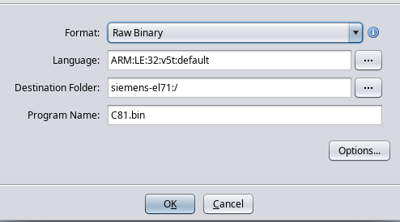
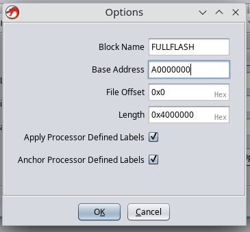
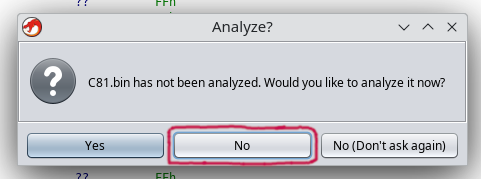
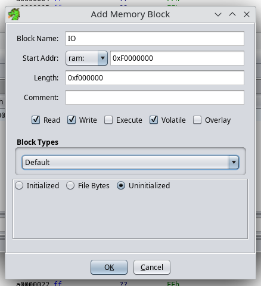

# How to reverse engineering Siemens in 2k24?
Prerequisites:
1. Installed the latest version of **Ghidra SRE**.
2. Fullflash from Siemens mobile phone (SGold platform).
3. Do [RAM memory dump](./memory-dump.md).

### Step 1: Open fullflash in the Ghidra
1. Run the disassembler and click `File` -> `Import File`
2. Select your fullflash.bin
3. Choose the appropriate disassembler settings:
    - Format: `Raw Binary`
    - Language: `ARM v5t 32 little`
    - Options -> Block Name: `FULLFLASH`
    - Options -> Base Address: `A0000000`
   <details>
        <summary>Sreenshot</summary>
        
        
    </details>

5. Then click on `fullflash.bin` in the project files.
6. Reject automatic analysis (press "No").
    <details>
        <summary>Screenshot</summary>
        
    </details>

### Step 2: Define IO memory region
1. Click `Window` -> `Memory Map`
2. Add a new memory region with given settings:
   - Block Name: `IO`
   - Start Addr: `0xF0000000`
   - Length: `0x0F000000`
   - Attributes: `[x] Read   [x] Write   [ ] Execute   [x] Volatile   [ ] Overlay`
   - Uninitialized
   <details>
        <summary>Screenshot</summary>
        
   </details>

### Step 3: Import memory dumps from your phone
You should import all memory dumps which you previously made ([RAM memory dump](./memory-dump.md)).

Example with RAM:
1. Click `File` -> `Add to Program`
2. Select your dump file, for e.g. `C81v51_RAM_A8000000_00800000.bin`.
3. Select apropriate settings:
   - Options -> Block Name: `RAM`
   - Options -> Base Addr: `0xA8000000`

   And click "OK".
4. Click `Window` -> `Memory Map` and select attributes for "RAM":

   ```
    R   W   X    Volatile
   [x] [x] [x]     [ ]
   ```

### Step 4: Import swilib C types
1. Download appropriate `swilib-types-PLATFORM.h` from the [Swilib data types for dissasembler](https://siemens-mobile-hacks.github.io/web-dev-tools/re#swilib-types).
2. Click: `File` -> `Parse C Source...`
3. Click `Clear profile` (eraser icon).
4. Add your `swilib-types-PLATFORM.h` to the "Source files to parse".
5. Select "Program architecture" to `ARM v5t 32 little`.
6. Press `Parse to Program` -> `Continue` -> `Don't use Open Archives` -> `OK`

### Step 5: Import swilib symbols
1. Download appropriate `symbols-PHONE.txt` from the [Firmware symbols for dissasembler](https://siemens-mobile-hacks.github.io/web-dev-tools/re#swilib-symbols).
2. Click `Window` -> `Script Manager` -> `ImportSymbolsWithDataType.java` -> `Run Script`
3. Select your `symbols-PHONE.txt`.

### Step 6: Import CPU IO registers
1. Download appropriate `cpu-PHONE.txt` or `cpu-pmb887x.txt` from the [CPU IO registers](https://siemens-mobile-hacks.github.io/web-dev-tools/re#cpu-registers).
2. Click `Window` -> `Script Manager` -> `ImportSymbolsWithDataType.java` -> `Run Script`
3. Select your `cpu-PHONE.txt` or `cpu-pmb887x.txt`.

### Analyze firmware
TODO
