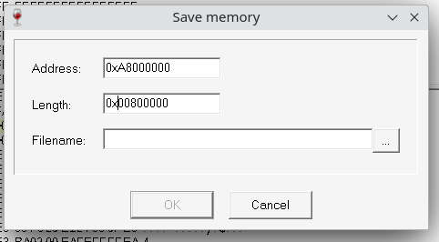

[← Back to the index](./index.md)

## Memory dump tools

1. 

        
ArmDebugger.exe (slow)

      ### This can be done using [ArmDebugger.exe](./arm-debugger.md).

      - Open context menu on hex view window
      - File -> Save to file  

        
    

2. [CLI memory dumper](https://github.com/siemens-mobile-hacks/siemens-memory-dumper)
3. [Web memory dumper](https://siemens-mobile-hacks.github.io/web-tools/dumper) (WebSerial).

## What memory should be dumped?

### For all phones
This memory regions available on all mobile phones.

| Name | Address  | Size     |      | Attributes         | Description                                              |
|------|----------|----------|------|--------------------|----------------------------------------------------------|
| BROM | 00400000 | 00008000 | 32k  | Read+Execute       | Built-in 1st stage bootloader firmware. |
| TCM  | 00000000 | 00004000 | 16k  | Write+Read+Execute | Built-in memory in the CPU, used for IRQ handlers.       |
| SRAM | 00080000 | 00018000 | 96k  | Write+Read+Execute | Built-in memory in the CPU.                              |

### ELKA
EL71, E71, M72 (proto), CL61 (proto)

| Name     | Address  | Size     |      | Attributes         | Description                  |
|----------|----------|----------|------|--------------------|------------------------------|
| RAM      | A8000000 | 01000000 | 16M  | Write+Read+Execute | External RAM.                |
| VMALLOC1 | AC000000 | 01000000 | 16M  | Write+Read+Execute | Virtual memory for malloc(). |
| VMALLOC2 | AD000000 | 00800000 | 8M   | Write+Read+Execute | Virtual memory for malloc(). |

### New NSG
C81, M81, S68

| Name     | Address  | Size     |     | Attributes         | Description                  |
|----------|----------|----------|-----|--------------------|------------------------------|
| RAM      | A8000000 | 01000000 | 16M | Write+Read+Execute | External RAM.                |
| VMALLOC1 | AC000000 | 00E00000 | 14M | Write+Read+Execute | Virtual memory for malloc(). |

### Old NSG + SG (16M)
S75, SL75, CX75, M75, SK65

| Name | Address  | Size     |     | Attributes         | Description   |
|------|----------|----------|-----|--------------------|---------------|
| RAM  | A8000000 | 01000000 | 16M | Write+Read+Execute | External RAM. |

### SG (8M)
CX70, C65, CX65, M65, S65, SL65, ME75, CF75, C75, C72

| Name | Address  | Size     |    | Attributes         | Description   |
|------|----------|----------|----|--------------------|---------------|
| RAM  | A8000000 | 00800000 | 8M | Write+Read+Execute | External RAM. |
